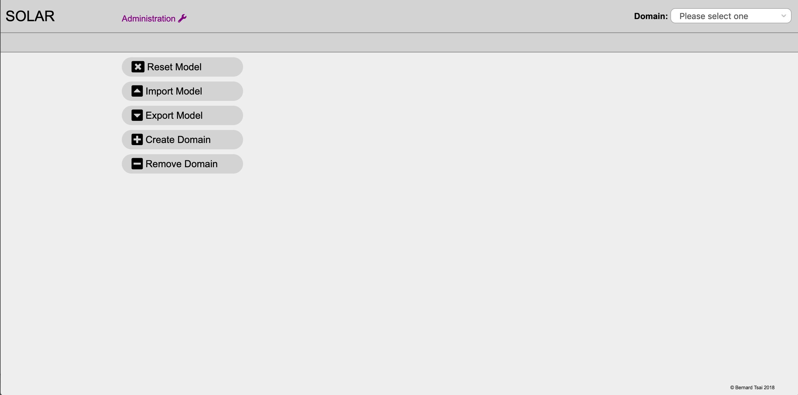

Instructions
============

This directory contains the scripts and docker definitions to build and run SOLAR as a docker container.

The assumption is that the sources have already been cloned from https://github.com/BernardTsai/solar.

Building the docker image
-------------------------

Invoke the script "build.sh" and verify that an image with the tag "tsai/solar" has been created .

```
> docker/build.sh
> docker images | grep tsai/solar
tsai/solar          latest              323ed9638e49        4 seconds ago       19.5MB
>
```

 Starting SOLAR as a daemon
---------------------------

Invoke the script "start.sh"

```
> docker/start.sh
```

Then open the following URL in a browser http://localhost/solar/index.html to verify that SOLAR is running. The browser should display the main administration screen.




Attaching to the SOLAR command line interface
---------------------------------------------

Invoke the script "attach.sh". The command will provide acces to the SOLAR command line interface

```
> docker/attach.sh
>>>
>>> help

Commands:
  architecture      architecture commands
  clear             clear the screen
  comment           comment
  component         component commands
  domain            domain commands
  exit              exit the program
  help              display help
  model             model commands
  output            output commands
  solution          solution commands
  task              task commands
  usage             usage command
>>>
```

To detach without exiting the container, use the escape sequence Ctrl-p Ctrl-q (this may not work on all operating systems).

Stopping SOLAR
--------------

Invoke the script "stop.sh". After executing the script the container will be removed automatically.

```
> docker/start.sh
```
