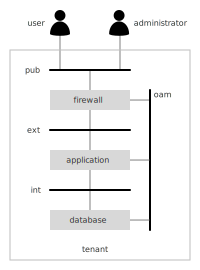

Demo
====

SOLAR provides a reference implementation of the concepts presented in this document. As such it does not manage actual resources and solution elements but rather simulates the administration procedures in order to serve as a proof-of-concept.

An example will help to demonstrate the capabilities of the orchestrated lifecycle management approach of SOLAR. In this example a simple application server hosted together with a database backend in a tenant is providing it's service via a firewall to users in the internet as shown in the diagram below.

The solution makes use of four networks for establishing communication amongst the applications, the users and administrators according to following considerations:

* users can access the application services from the internet (pub) via the firewall
* administrators can manage the firewall, the application server and the database from the internet (pub) via the firewall
* the firewall forwards external user requests via the machine-to-machine network (ext)
* the firewall forwards external administrative requests via the operation, administration and maintenance network (oam)
* the application server persists its information to the database via the machine-to-machine network (int)

All applications need to be hosted on their corresponding servers which belong together with the networks listed above to a tenant context.

The following sections explain how to make use of the SOLAR system in order to handle the tasks listed below:

* **Administration:** i.e. how to setup and manage domains representing independent administrative realms with their corresponding catalog, architectures and solutions.
* **Catalog Management:** describing how to define and manage components which will serve as the building blocks for a solution
* **Architecture Design:** covers the steps in order to define a blueprint for solutions which can then later be deployed automatically
* **Solution Management:** explains how to obtain an overview of the status of a solution and conduct simple operational tasks such as scaling clusters or changing the lifecycle state of individual instances of solution elements.
* **Automation Control:** allows to visualise and manage the flow of activities related to automated change procedures.

Administration
==============

SOLAR makes use of a central repository holding a model which is split up into several independent administrative domains.

The first step is therefore to create a domain for the example solution by opening the web interface of SOLAR (URL: http://localhost/solar/index.html).

The administration view of SOLAR will appear offering the possibility to conduct the following five administrative tasks:

1. **Create Domain:** allows to define a new administrative domain with an independent catalog and set of architecture blueprints and solutions,
2. **Remove Domain:** provides the possibility to completely remove a domain from the repository,
3. **Reset Model:** removes all domains from the repository,
4. **Import Model:** imports a repository by uploading the contents of a local file and
5. **Export Model:** exports a repository by downloading the contents of the repository into a file.

Clicking on "Create Domain" will prompt the user to enter the name of a new domain. For this example enter "demo" and press "OK".

A new domain with the name "demo" will be created and SOLAR will present the catalog view of the domain. A different domain can be selected at any time by picking one of the domains offered in the selection at top right of the navigation bar at the top of the screen.

Catalog Management
==================

The catalog view allows to define the components which may serve as the building blocks for solutions. It can be selected by clicking on the catalog icon in the navigation bar at the top of the screen. Initially the catalog is empty.

This example requires four types of components:

1. a **tenant** representing a virtual datacenter containing servers and networks
2. a **network** representing a communication domain via which servers and/or external communication partners can communicate with one another
3. a **server** which will host applications and which is connected to networks
4. an **application** representing software processes which are deployed to servers and may depend on the services exposed by other hosts.

The components will be listed on the left side of the window whereas details of a component will be presented on the right side of the screen.

Creating a new component
------------------------

Pressing the "+" button on the left side will open the detail view for a new component. Initially the attributes of the new component are set to default values and need to be redefined.

The main attributes for a component are:

* the **name** of the component (this corresponds to the type of a solution instance),
* the **version** represented by a string starting with a 'V' and followed by a version number which complies with the rules for semantic versioning (e.g. V1.10.3) and
* a **base configuration**, which can be a component specific configuration string.

The screenshot below displays the information of a "tenant" component:

The component is added to the catalog by pressing the "Create" button on the top right of the details view.

The components which have been stored in the catalog appear on the left side of the screen.

A "network" component can be defined in the similar way. It is assumed that a "network" has a runtime context dependency to a "tenant", i.e. it can only be created within the context of a tenant.

A new dependency is added by clicking on the "+" icon on the right of the dependencies list which is initially empty. A prompt will appear asking for the name of the dependency.

Each dependency is described by:
* the **type** of dependency (runtime context or service context),
* the **component** type which can fulfil the dependency,
* the required **version** of the component type and
* an optional dependency specific **base configuration**.

Dependencies which are not needed can be removed by pressing the "-" icon to the left of each dependency.

It is important to note that changes to the repository will only be made if the "Create" button is pressed.

The following screenshots display the definition for the "server" component. The assumption is that "servers" require a "tenant" and "networks" as their runtime context.

Updating a component
--------------------

"Applications" require "servers" as their runtime context and other "applications" as their service context. Since the "application" component has a self-referential service dependency to itself it is necessary to first create the component without this dependency and then later update the component by adding the missing dependency. This can be achieved by pressing the icon to the left of a component in the list, which will open the details view for the component again.

The changes made will only be synchronised with the repository after pressing the "Update" button on the top right of the details view. It is recommended to not change a component definition after having referred to it in the context of dependencies or architecture blueprints.

Duplicating a component
-----------------------

In some cases it might be helpful to make a copy of an existing component definition without having to reenter all the information, e.g. when creating a new version of a component definition. The detail view of a component offers a "Duplicate" button for this purpose, which when pressed copies the definitions of the component and updates the minor number of the version indicator. The "Update" button will allow to then persist any required modifications.

Deleting a component
--------------------

The "Delete" button of the component detail view allows to remove the component definition from the repository in the case this definition is not required any longer.

At this point all required components have been defined and can now be used for designing an architecture which will serve as a solution blueprint.

Architecture Design
===================

It is necessary to first model the blueprint of a solution in order to later automate the lifecycle management of its elements.

The catalog contains all the components serving as the potential building blocks of such a solution. A target architecture for a solution is designed by one by one adding components as solution elements to a solution and configuring them according to the environment specific considerations.

A solution element resembles a functional element of a specific component type providing a service which may evolve over time. A solution element may therefore consist of clusters - each representing a specific version of the component and holding a group of component instances of the same version.

Creating an architecture for a new solution
-------------------------------------------

The first step is to create a new solution by changing to the architecture view of SOLAR. This can be achieved by clicking on the "Architecture" icon on the top of the window.

Then press the "Create" button on the top right of the window to define the name of the solution for which an architectural blueprint should be designed.

A prompt will appear asking for the name of the new solution. For this example enter "app" and press "OK".

The initial version of the architecture will be "V0.0.0" and not hold any elements as shown in the screenshot below.

The architecture view of SOLAR will show the catalog components to the left and the architecture design on the right side. At the top right a set of buttons allow to update, deploy, duplicate and delete architectures as described later in this section.

The naming convention implies that the name of the architecture and the name of the solution need to be the same. It probably will become necessary to design several versions of the solution architecture to support the evolution of the solution and therefore each architecture will have a specific version tag following the naming conventions for versions (represented by a string starting with a 'V' and followed by a version number which complies with the rules for semantic versioning, e.g. V1.10.3)

In order to continue working on an existing architecture simply select an architecture from the options presented in the select box at the top left of the window.

Adding an architecture element
------------------------------

Solution elements can be added to the architecture by clicking on the "+" icon located right to the required component.

In order to create a "tenant" solution element click on "+" icon next to the tenant component. A prompt will appear asking which name the name tenant element should have.

After entering "Tenant" and pressing OK a new element with the specified name and of selected component type is added to the architecture.

Editing an architecture element
-------------------------------

After having selected which component to add and assigning a name to the element a dialog for entering configuration information is presented:

The name of the element and the component type of the element can not be changed anymore. The configuration field allows to enter information which relates to all versions of the solution element.

A solution element may need to support several version and therefore specific configurations for each version need to be taken into account. A dropdown box next to the "Clusters" label allows to select a version and then enter the corresponding cluster configuration information.

The main cluster specific configuration information relates to following attributes:

* the **target state** which describes which lifecycle state the instances of the cluster should have,
* the **minimum size** which states how many instances the cluster should at least have,
* the **maximum size** which states how many instances the cluster should at most have,
* the **current size** which states how many instances of the cluster should have the desired target state and
* the **configuration** which holds any cluster and component type specific configuration information for the element.

The "Tenant" solution element will not require any additional information and by clicking on "close" icon next to the "Component" headline of the catalog an overview of the currently presented architecture will be shown:

It depicts a single box referring to the new solution element "Tenant" of component type "tenant". The green dot on the top indicates that it exposes one cluster service interface which should be active.

The relationship details are of relevance when defining the "OAM" network element.  After adding a "network" element with the name "OAM" to the architecture and selecting the cluster "V1.0.0" add a new relationship to the cluster by pressing "+" icon located at the far right to the "Relationships" label.

A prompt appears asking for the name of the new relationship:

Entering "tenant" and pressing OK  will add a line to the relationships table. Specifying that "Dependency" should relate to the "Tenant" dependency of a "network" component and referring to the "Tenant" element of the solution by selecting it from the drop-down box and optionally entering configuration information for the relationship is what is needed to specify the relationship in detail:

Changing back to the overview by pressing the "close" button next to the "Component" label of the catalog shows how the two components relate to one another:

The solid line between the "oam" element and the "tenant" element indicates that there is runtime context dependency between these two entities.

Duplicating an architecture element
-----------------------------------

Elements can be duplicated in order to simplify the process of creating similar elements. After clicking on the "oam" element in the overview the dialog appears allowing to edit the element information. This dialog also exposes at the top right a button to duplicate this element. When clicking on the button a prompt appears asking for the name of the element:

After entering "m2m" and pressing "OK" the dialog for editing the new "m2m" element appears in which all of the attributes of the "oam" element have been copied apart from the name. Switching back to the overview displays how the new element fits into the architectural overview.

Deleting an architecture element
--------------------------------

Removing an element from the architecture is achieved is by selecting an element from the overview and pressing on the "Delete" button located at the top right of the dialog.

Updating an architecture
------------------------

It is essential to upload the architecture definition to the repository after having added and configured all the required elements:

This is achieved by pressing the "Update" button at the top right of the window (architectures should not be updated as soon as they have been deployed in order to avoid inconsistencies).

Duplicating an architecture
---------------------------

The architecture of a solution needs to evolve. SOLAR therefore offers the possibility to make a copy of the architecture and assigning it a new version tag by pressing the "Duplicate" button located at the top right of the window.

A prompt will appear asking for the version identifier and the architecture overview will present the newly created copy of the architecture.

Deleting an architecture
------------------------

Architectures which are not needed any longer can be easily removed by first selecting the appropriate architecture and then pressing the "Delete" button at the top right of the window.

Deploying an architecture
-------------------------

An architecture defines the target picture of a solution. This may differ from the current state a solution may have. SOLAR offers the possibilities to automatically derive the required transactions in order to converge the current state to the target state defined by an architecture.

For this purpose it is necessary to first select the desired version of the architecture and then press the "Deploy" button located at the top right of the window.

This triggers the closed-loop deployment process. The view will switch to the solution view which will be explained in the following section.

Solution Management
===================

Managing a solution requires obtaining an overview of the current state of a solution and all of its solution elements. The solution management view can be selected by clicking on the "Solution" button at the top of the window.

Selecting a Solution
-------------------

There may be several solutions within a domain. To select a specific solution pick a solution from the drop-down box located at the top left of the window.

The overview displays on the left side the elements of the solution as a table. The right side displays the architecture in a graphical representation which displays a box for each element. The labels within each box state the name of the element and to which type of component the solution element belongs. The circles at the top of each box relate to the status of each cluster of the solution element:

* **grey:** initial state
* **yellow:** inactive state
* **green:** active state
* **red:** failure state

The circles at the bottom relate to the various relationships the solution elements may have to other solution elements. These relationships are depicted as solid or dashed lines. Solid lines relate to runtime context dependencies whereas service context dependencies are shown as dashed lines.

The view can be refreshed by pressing the "Refresh" button at the top right of the window.

View the Tasks Related to a Solution
------------------------------------  

Tasks may be associated with the creation, modification or deletion of a solution. An overview of all the tasks related to the specific solution are is obtained by pressing the "Tasks" button at the top right of the window.

Display the Status of a Solution Element
----------------------------------------

In order to display the status of a single solution element either press on the icon right to element listed on the left side of the window or click on one of the solution elements:

The status of the solution element display the current sizing of the clusters and the status of each cluster instance.

Pressing the "Close" button on the top right of the element list closes the detail view and changes the view back to the solution overview.

Display the Configuration of a Solution Element
-----------------------------------------------

The current configuration of a solution element is displayed after pressing the "Configuration" button at the top right of the dialog.

By pressing the "Status" button the view is changed back to the status view of the solution element.

View the Tasks Related to a Solution Element
--------------------------------------------  

Tasks may be associated with the scaling of cluster and the lifecycle management of instances of solution elements. An overview of all the tasks related to the specific solution are is obtained by pressing the "Tasks" button at the top right of the dialog.

Administrate the Lifecycle of a Solution Element
------------------------------------------------

The desired target state of a instances of a cluster or of single instances of a cluster may be adjusted by clicking on the corresponding buttons. The task may take some time and therefore it is recommended to click on the refresh button to verify that the changes have been applied as desired.

Some changes may not be applicable since they would violate scaling rules (e.g. deactivating an instance of cluster where all cluster instances need to be active)

Scale a Solution Element
------------------------

The status view allows to adjust the scaling of a cluster by modifying the target size parameters of the cluster and pressing the corresponding update button. The task may take some time and therefore it is recommended to click on the refresh button to verify that the changes have been applied as desired.

Automation Control
==================

The closed-loop algorithm initiates a vast set of tasks in order to converge the current state of the solution towards a desired target state. These tasks may relate to:

* the solution level or
* the element level or
* the cluster level or
* the instance level

of the solution. Tasks may trigger a hierarchy of required subtasks and are executed until either:

* the task terminates successfully or
* the task fails or
* the task runs into a timeout or
* the task has been terminated by DevOps intervention.

Events relate to these situations tasks and may trigger subsequent tasks.

The automation control view of SOLAR can be selected by clicking on the "Automation" button at the top of the window.

Filtering Automation Tasks
--------------------------

The automation control view allows to identify the relevant tasks by successively drilling down to the level of entities for which the relevant tasks should be listed:

This is achieved by selecting the specific solution, solution element, cluster and instance with the help of drop-down fields located at the top of the window.

The list of tasks are presented in chronological order with the latest initiated tasks listed first exposing:

* the type of the task,
* the UUID of the task,
* the desired architecture version or instance state,
* the time the task was started
* the time the time has been completed
* the last known event related to the task and
* the status of the task .

The list can be refreshed by pressing on the "Refresh" button.

Displaying an Automation Task
-----------------------------

Clicking on a task item in the task list displays the task flow with the help of a graphical representation:

The graph displays the affected entities (elements/clusters and instances) as horizontal swimlanes containing the related tasks. The events exchanged between the tasks a depicted as vertical lines originating from the source task and directed to the task which is to be informed about the event. A red vertical cursor allows to determine the time at which a certain event has occurred.

Clicking on a swimlane opens the solution view and focuses on the corresponding solution element.

The view can be refreshed by pressing on the "Refresh" button and closed by clicking on the "Close" button next to it.
